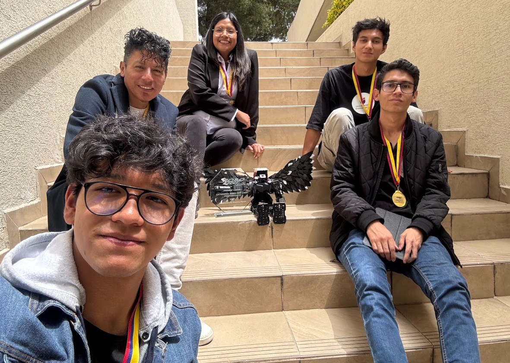
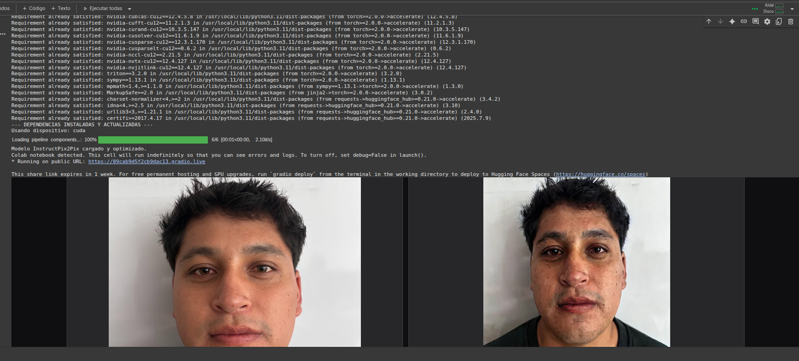
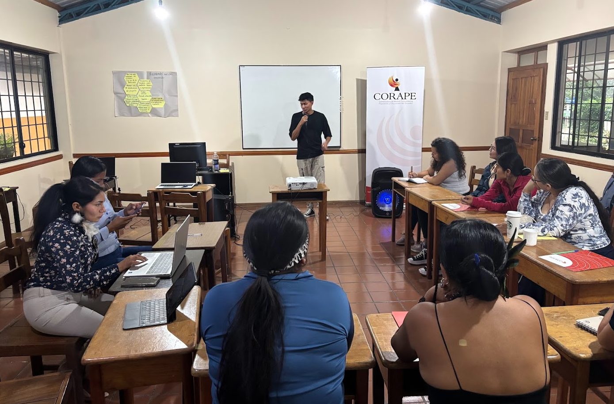

<h3>Estudiante de Ingeniería en TI | Apasionado por la IA, el Desarrollo y la Robótica</h3>

Soy un apasionado por la IA y líder de proyectos en formación, enfocado en transformar ideas complejas en soluciones tecnológicas funcionales. Me interesa especializarme en <b>Inteligencia Artificial</b> y <b>Machine Learning</b>, y me encanta enfrentar desafíos que me permitan crecer y aportar valor. ¡Bienvenido a mi portafolio!

<h2 align="center">Tecnologías y Herramientas en aprendizaje</h2>

<table width="100%">
<tr>
<td align="center" width="33%">
<h4><b>Lenguajes de Programación</b></h4>

</td>
<td align="center" width="33%">
<h4><b>IA & Machine Learning</b></h4>

</td>
<td align="center" width="33%">
<h4><b>Herramientas y Plataformas</b></h4>

</td>
</tr>
</table>

<h2 align="center">Proyectos Destacados</h2>

<!-- Proyecto 1: KUNTUR -->

<table width="100%">
<tr>
<td width="65%" valign="top">
<h3><b>1. Robot Humanoide "KUNTUR"</b></h3>

Como Presidente del Club de Programación y Robótica, lideré el diseño y construcción del robot humanoide KUNTUR para el torneo <b>ROBO ONE Ecuador</b>. Este proyecto fue una prueba intensiva de habilidades técnicas, trabajo en equipo y resolución de problemas bajo presión.

<h4><b>Logros Clave:</b></h4>
<ul>
<li>🏆 <b>1er Lugar</b> - Categoría ROBO ONE light PERFORMANCE.</li>
<li>🥉 <b>3er Lugar</b> - Categoría ROBO ONE light Combate.</li>
</ul>
</td>
<td width="35%" align="center">

</td>
</tr>
</table>

 

<!-- Proyecto 2: Diseño Generativo -->

<table width="100%">
<tr>
<td width="35%" align="center">

</td>
<td width="65%" valign="top" style="padding-left: 20px;">
<h3><b>2. IA Generativa para Filtros Faciales</b></h3>

Actualmente, coordino un equipo en un proyecto de prácticas colaborativas con la PUCE. El objetivo es desarrollar un modelo de <b>IA capaz de generar filtros faciales realistas</b> para simular el envejecimiento y el deterioro de la salud, un reto fascinante en el campo de la IA Generativa.

<h4><b>Mi Rol:</b></h4>
<ul>
<li>Líder técnico del desarrollo del modelo.</li>
<li>Entrenamiento de algoritmos de IA Generativa en Google Colab.</li>
<li>Coordinación del equipo y la estrategia técnica.</li>
</ul>
</td>
</tr>
</table>

 

<!-- Proyecto 3: Colmena -->

<table width="100%">
<tr>
<td width="65%" valign="top">
<h3><b>3. Servidor Offline "Colmena"</b></h3>

Fui el jefe técnico en la implementación de una <b>unidad móvil de podcasting</b> para operar en comunidades de la Amazonía sin acceso a internet. El desafío fue crear una solución tecnológica robusta, offline y fácil de usar para las comunicadoras de la red CORAPE.

<h4><b>Responsabilidades Clave:</b></h4>
<ul>
<li>Ensamblaje y configuración del servidor local (Linux, 32GB RAM, 2TB SSD).</li>
<li>Despliegue de la plataforma "Colmena" usando <b>Docker y PostgreSQL</b>.</li>
<li>Diagnóstico de errores y capacitación técnica a las usuarias en Puyo y Sarayaku.</li>
</ul>
</td>
<td width="35%" align="center">

</td>
</tr>
</table>

☕

