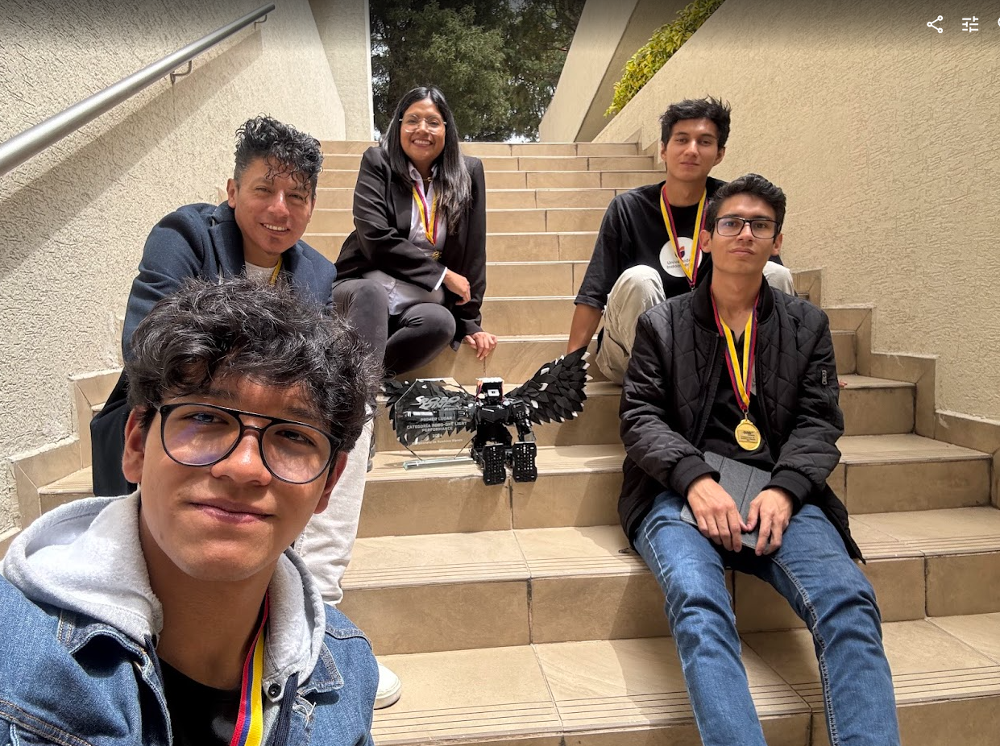

  

<h1 align="center">👋 ¡Hola! Soy Joel Sebastián Morales Játiva</h1>
<h3 align="center">Estudiante de Ingeniería en TI | Apasionado por la IA, el Desarrollo y la Robótica</h3>

Soy un desarrollador y líder de proyectos en formación, enfocado en transformar ideas complejas en soluciones tecnológicas funcionales. Me especializo en <b>Inteligencia Artificial</b> y <b>Machine Learning</b>, y me encanta enfrentar desafíos que me permitan crecer y aportar valor. ¡Bienvenido a mi portafolio!

<!--
ESTADÍSTICAS DE GITHUB Estas tarjetas se actualizan solas. ¡IMPORTANTE! Reemplaza 'j03l1725' con tu nombre de usuario exacto de GitHub en los dos enlaces de abajo. Puedes personalizar los temas aquí: https://www.google.com/search?q=https://github.com/anuraghazra/github-readme-stats/blob/master/themes/README.md
-->

<h2 align="center">📊 Mis Estadísticas en GitHub</h2>

  

<!--
HABILIDADES TÉCNICAS (CON INSIGNIAS) Usamos Shields.io para crear estas insignias. Puedes buscar más iconos y personalizar los colores aquí: https://simpleicons.org/
-->

<h2 align="center">🛠️ Tecnologías y Herramientas</h2>

<b>Lenguajes de Programación</b> 

  
<b>IA & Machine Learning</b> 

  
<b>Herramientas y Plataformas</b> 

  
<b>Redes y Simulación</b> 

<h2 align="center">🚀 Proyectos Destacados</h2>

🤖 1. Robot Humanoide "KUNTUR" - Torneo ROBO ONE Ecuador
Como Presidente del Club de Programación y Robótica, lideré un equipo para diseñar, construir y competir con nuestro robot humanoide, KUNTUR. Esta experiencia puso a prueba no solo nuestras habilidades técnicas, sino también nuestra capacidad de trabajo en equipo y resolución de problemas bajo presión.

Logros:

🏆 1er Lugar - Categoría ROBO ONE light PERFORMANCE.

🥉 3er Lugar - Categoría ROBO ONE light Combate.

💻 2. Proyecto "Diseño Generativo" - Colaboración con PUCE
Actualmente, coordino un equipo en un proyecto de prácticas colaborativas con la PUCE. Nuestro objetivo es desarrollar un modelo de IA capaz de generar filtros faciales realistas para simular el envejecimiento y el deterioro de la salud.

Mi Rol:

Soy el responsable técnico del desarrollo del modelo, utilizando IA Generativa y entrenando los algoritmos en Google Colab.

<!--
Ejemplo de cómo añadir una imagen o GIF:

-->

🌐 3. Servidor "Colmena" - Proyecto Red de Comunicadoras (CORAPE)
Fui el jefe técnico en la implementación de una unidad móvil de podcasting para operar en comunidades de la Amazonía sin acceso a internet. El desafío era enorme: crear una solución tecnológica robusta, offline y fácil de usar para las comunicadoras locales.

Responsabilidades Clave:

Ensamblaje y configuración del servidor local (Linux, 32GB RAM, 2TB SSD).

Despliegue de la plataforma "Colmena" usando Docker y PostgreSQL.

Diagnóstico de errores y capacitación a las usuarias en Puyo y Sarayaku.

<!--
Ejemplo de cómo añadir una imagen o GIF:

-->
