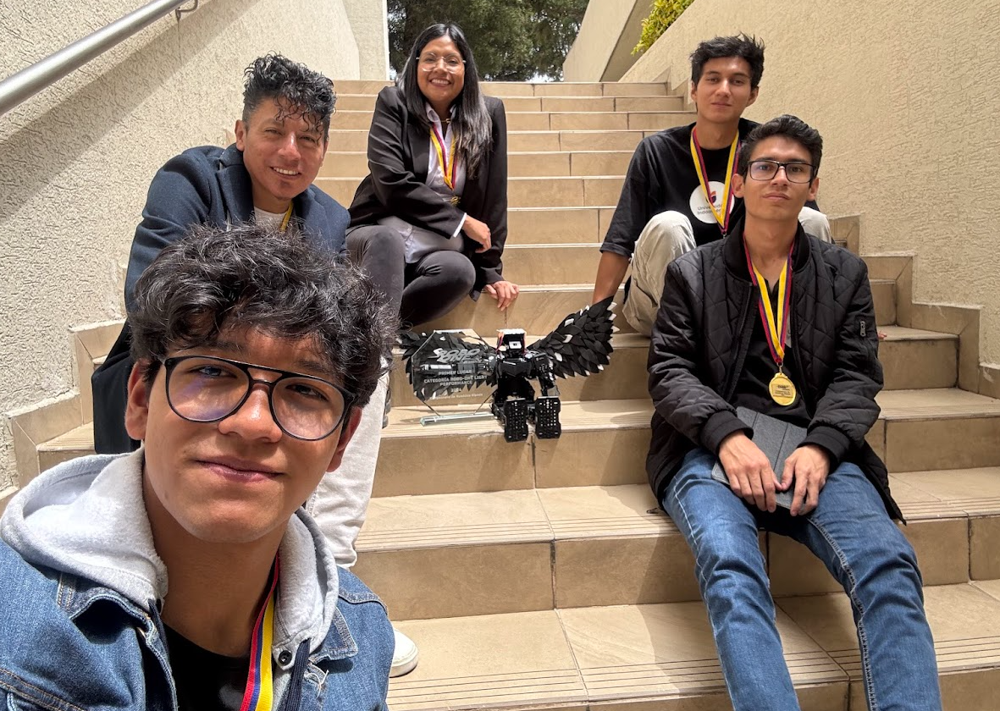
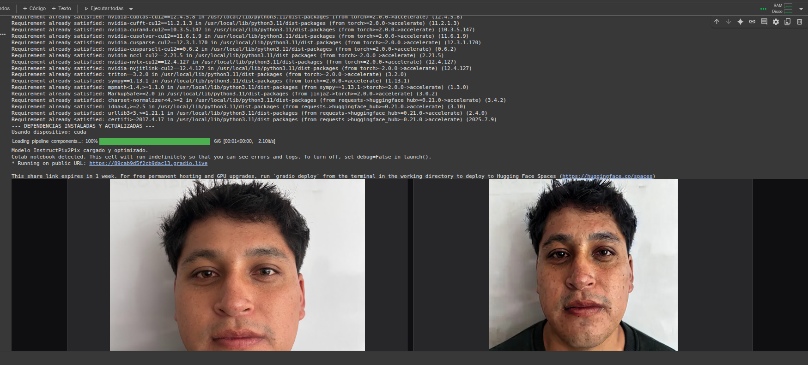
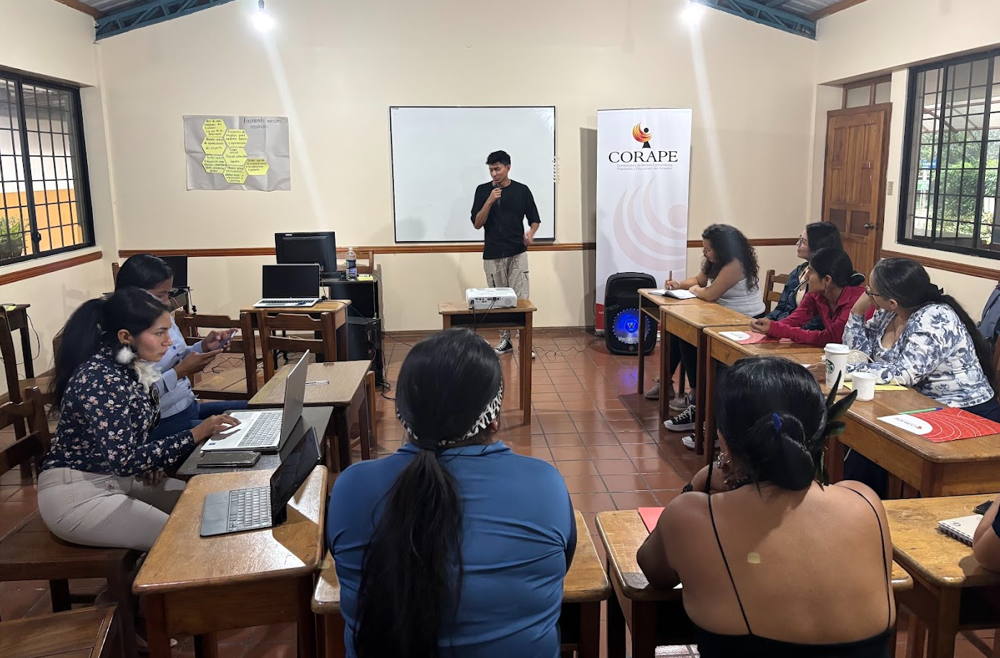

<picture>
  <source media="(prefers-color-scheme: dark)" srcset="img/terminal-dark.svg">
  <source media="(prefers-color-scheme: light)" srcset="img/terminal-light.svg">
  
</picture>

<h2>Proyectos</h2>

<table>
<tr>
<td width="33%" align="center" valign="top">

  
<code>KUNTUR</code> 
<b>Robot Humanoide</b> · ROBO ONE Ecuador 
🏆 1° Performance · 🥉 3° Combate
</td>
<td width="33%" align="center" valign="top">

  
<code>IA Generativa</code> 
<b>Filtros faciales</b> · U. Católica del Ecuador 
Coordinador técnico del modelo
</td>
<td width="33%" align="center" valign="top">

  
<code>Colmena</code> 
<b>Servidor offline</b> · Amazonía 
Docker + PostgreSQL · Red CORAPE
</td>
</tr>
</table>

